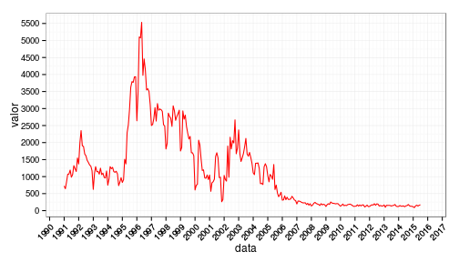
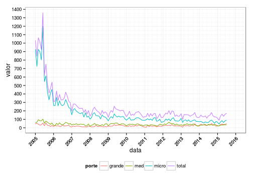
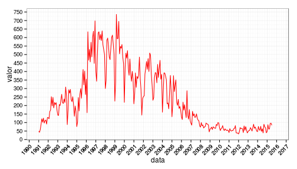
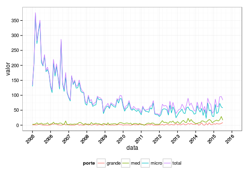
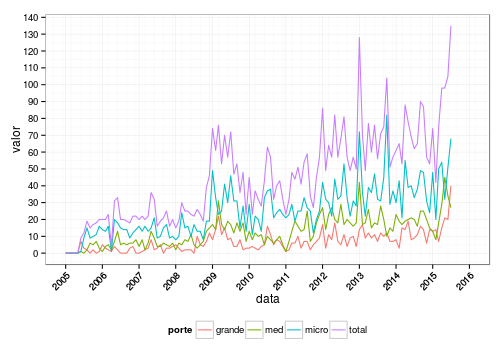
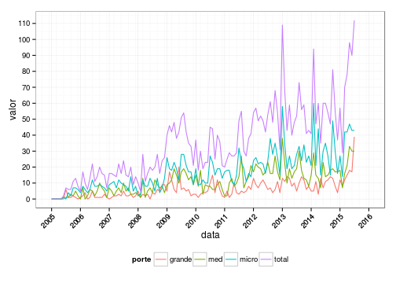

## Falências e recuperacões judiciais no Brasil!

Os dados do Serasa Experian contêm informações mensais de número de falências requeridas, falências decretadas, recuperações requeridas e recuperações concedidas.

O repositório contém um shiny app minimal com os dados baseados nas informações do Serasa. Os dados são atualizados a cada nova sessão (~500 kB), então pode demorar um pouco para rodar. Para rodar o app no seu computador, rode no RStudio:

```
shiny::runGitHub('jtrecenti/falrec', subdir='inst/shiny-examples/falrec')
```

## Análise inicial

```r
library(dplyr)
library(ggplot2)
library(falrec)
library(scales)
d <- ler_dados()
```

-----

## Falências requeridas

### Entre 1991 até agora


```r
d %>%
  filter(porte == 'total', tipo == 'fal_req') %>%
  ggplot(aes(x = data, y = valor)) +
  geom_line(colour = 'red') +
  scale_x_date(breaks = date_breaks('1 year'), 
               minor_breaks = "3 months",
               labels = date_format("%Y"),
               limits = c(as.Date("1991-01-01"), 
                          as.Date('2016-01-01'))) +
  scale_y_continuous(breaks = 0:100 * 500) +
  theme_bw() +
  theme(axis.text.x = element_text(angle = 45, hjust = 1)) +
  theme(legend.position="bottom")
```

 

### Entre 2005 até agora


```r
d %>%
  filter(tipo == 'fal_req', 
         data >= as.Date('2005-01-01')) %>%
  ggplot(aes(x = data, y = valor, colour = porte)) +
  geom_line() +
  scale_x_date(breaks = date_breaks('1 year'), 
               minor_breaks = "3 months",
               labels = date_format("%Y"),
               limits = c(as.Date("2005-01-01"), 
                          as.Date('2016-01-01'))) +
  scale_y_continuous(breaks = 0:100 * 100) +
  theme_bw() +
  theme(axis.text.x = element_text(angle = 45, hjust = 1)) +
  theme(legend.position="bottom")
```

 

-----

## Falências decretadas

### Entre 1991 até agora


```r
d %>%
  filter(porte == 'total', tipo == 'fal_dec') %>%
  ggplot(aes(x = data, y = valor)) +
  geom_line(colour = 'red') +
  theme_bw() +
  scale_x_date(breaks = date_breaks('1 year'), 
               minor_breaks = "3 months",
               labels = date_format("%Y"),
               limits = c(as.Date("1991-01-01"), 
                          as.Date('2016-01-01'))) +
  scale_y_continuous(breaks = 0:100 * 50) +
  theme_bw() +
  theme(axis.text.x = element_text(angle = 45, hjust = 1)) +
  theme(legend.position="bottom")
```

 

### Entre 2005 até agora


```r
d %>%
  filter(tipo == 'fal_dec', 
         data >= as.Date('2005-01-01')) %>%
  ggplot(aes(x = data, y = valor, colour = porte)) +
  geom_line() +
  scale_x_date(breaks = date_breaks('1 year'), 
               minor_breaks = "3 months",
               labels = date_format("%Y"),
               limits = c(as.Date("2005-01-01"), 
                          as.Date('2016-01-01'))) +
  scale_y_continuous(breaks = 0:100 * 50) +
  theme_bw() +
  theme(axis.text.x = element_text(angle = 45, hjust = 1)) +
  theme(legend.position="bottom")
```

 

-----

## Falências decretadas

### Entre 1991 até agora


```r
d %>%
  filter(porte == 'total', tipo == 'fal_dec') %>%
  ggplot(aes(x = data, y = valor)) +
  geom_line(colour = 'red') +
  theme_bw() +
  scale_x_date(breaks = date_breaks('1 year'), 
               minor_breaks = "3 months",
               labels = date_format("%Y"),
               limits = c(as.Date("1991-01-01"), 
                          as.Date('2016-01-01'))) +
  scale_y_continuous(breaks = 0:100 * 50) +
  theme_bw() +
  theme(axis.text.x = element_text(angle = 45, hjust = 1)) +
  theme(legend.position="bottom")
```

 

### Entre 2005 até agora


```r
d %>%
  filter(tipo == 'fal_dec', 
         data >= as.Date('2005-01-01')) %>%
  ggplot(aes(x = data, y = valor, colour = porte)) +
  geom_line() +
  scale_x_date(breaks = date_breaks('1 year'), 
               minor_breaks = "3 months",
               labels = date_format("%Y"),
               limits = c(as.Date("2005-01-01"), 
                          as.Date('2016-01-01'))) +
  scale_y_continuous(breaks = 0:100 * 50) +
  theme_bw() +
  theme(axis.text.x = element_text(angle = 45, hjust = 1)) +
  theme(legend.position="bottom")
```

 

-----

## Recuperações requeridas


```r
d %>%
  filter(tipo == 'rec_req', 
         data >= as.Date('2005-01-01')) %>%
  ggplot(aes(x = data, y = valor, colour = porte)) +
  geom_line() +
  scale_x_date(breaks = date_breaks('1 year'), 
               minor_breaks = "3 months",
               labels = date_format("%Y"),
               limits = c(as.Date("2005-01-01"), 
                          as.Date('2016-01-01'))) +
  scale_y_continuous(breaks = 0:100 * 10) +
  theme_bw() +
  theme(axis.text.x = element_text(angle = 45, hjust = 1)) +
  theme(legend.position="bottom")
```

 

## Recuperações deferidas


```r
d %>%
  filter(tipo == 'rec_def', 
         data >= as.Date('2005-01-01')) %>%
  ggplot(aes(x = data, y = valor, colour = porte)) +
  geom_line() +
  scale_x_date(breaks = date_breaks('1 year'), 
               minor_breaks = "3 months",
               labels = date_format("%Y"),
               limits = c(as.Date("2005-01-01"), 
                          as.Date('2016-01-01'))) +
  scale_y_continuous(breaks = 0:100 * 10) +
  theme_bw() +
  theme(axis.text.x = element_text(angle = 45, hjust = 1)) +
  theme(legend.position="bottom")
```

 

-----

Licensa

GNU GPLv2.

